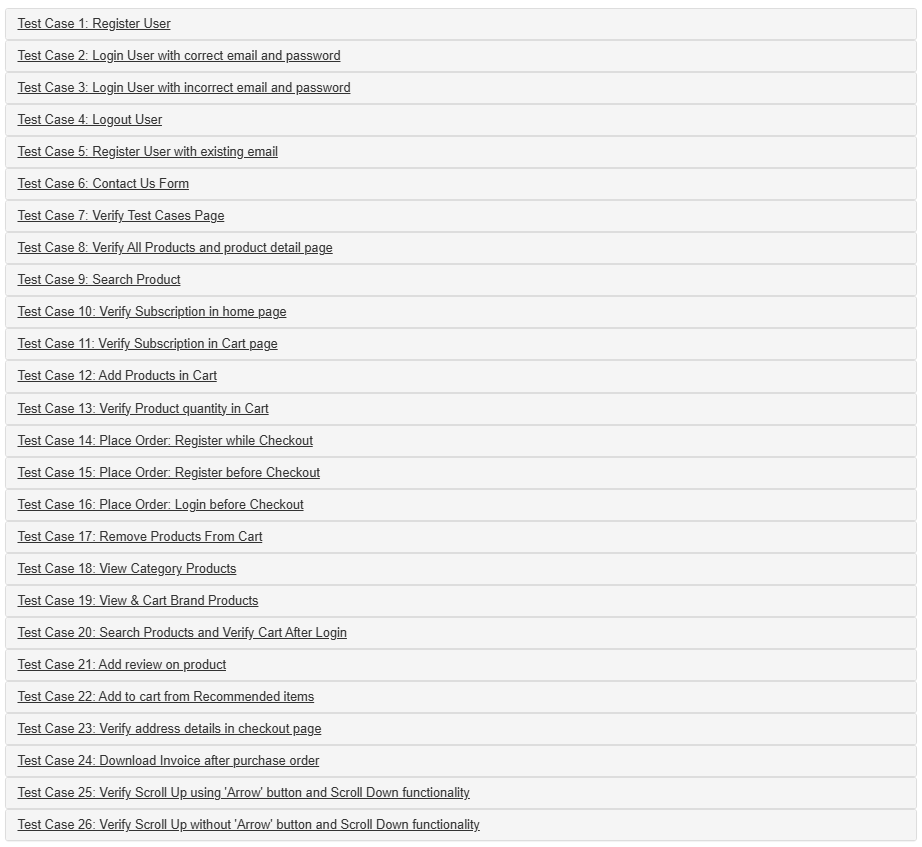

# Automation Exercise Tests

End-to-end test automation project for [Automation Exercise](https://automationexercise.com/) built with Playwright and TypeScript.

## Overview

This project covers user journeys from the Automation Exercise test cases, including authentication, product search, cart, checkout, subscription, contact form, and scroll behaviour.



## Tech stack

- Playwright
- TypeScript
- Page Object Model
- Custom fixtures
- Reusable test flows
- API helpers
- Faker.js
- GitHub Actions

## Project structure

```text
api/            API helpers, e.g. user creation/deletion
assets/         files used during tests and README images
fixtures/       custom Playwright fixtures
flows/          reusable business flows
models/         shared TypeScript models
pages/          page objects and page components
tests/          test specifications grouped by feature
utils/          test data factories